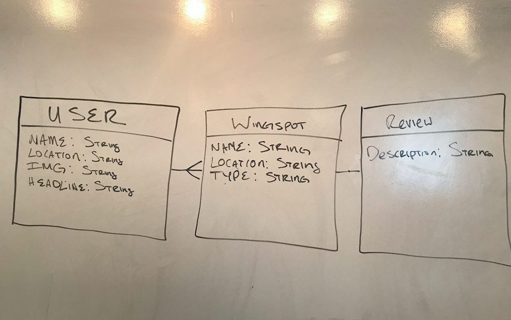
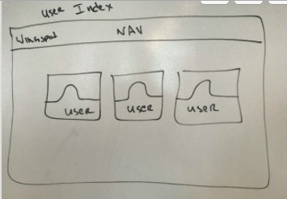

# WingSpot

#Overview Wing Spot is a full stack application where users can create a user profile which inclused their name, location, image and a headline. Once a user has been created, they are able to add a Wing Spot(establishment) and review the establishment on their wings, vegan wings included. The application is fullcrud on two of its three models.

#Live site https://calm-brushlands-83999.herokuapp.com/

#Technologies Used Languages HTML5, CSS3, Bootstrap,Font Meme,Trello VS Code, and Adobe Photoshop.

#Wire Frame

#Trello https://trello.com/b/lU2KJD8A/wingspot

#Reflections: I learned crud. I also have a better understand of how the back end is connected and most importantly how to render in Handlebars.I still have work to do to fully grasp concepts like req.body and how to call data in controllers to render in HBS. Overall my understanding of rMVC is clear. I'm looking forward to creating on the knowledge that I gained over the past week.

#Phase 2 Adding Auth to the project and continue to stlye.
=======

